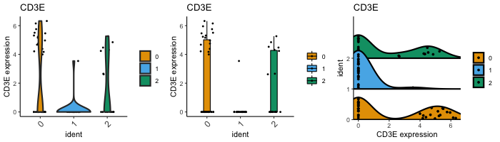

```{r, echo=FALSE, results="hide", message=FALSE}
knitr::opts_chunk$set(error=FALSE, message=FALSE, warning=FALSE)
library(BiocStyle)
```

```{r}
library(dittoSeq)
# library(Seurat)
```

```{r}
# For working with scRNAseq data, works directly with Seurat and SingleCellExperiment objects
seurat <- Seurat::pbmc_small
dittoPlot("CD14", seurat, group.by = "ident")

sce <- Seurat::as.SingleCellExperiment(seurat)
dittoBarPlot("ident", sce, group.by = "RNA_snn_res.0.8")
```

```{r}
# For working with bulk RNAseq data, first load your data into a format that dittoSeq quickly understands
# deseq2 <- importDESeq2()
# edger <- importEdgeR()
# limma.voom <- importEdgeR()
myRNA <- RNAseq_mock

# Add metadata 
c(1:10)

dittoDimPlot("Gene1", myRNA, size = 3)
```

### Helper Functions

Quickly determine metadatas, genes, and dimensionality reductions that can be used for making plots with universal helper functions:

```{r}
get.metas(seurat)
is.meta("nCount_RNA", seurat)

get.genes(myRNA)
is.gene("CD3E", myRNA)

get.reductions(sce)

# View them with these:
gene("CD3E", seurat, data.type = "raw")
meta("groups", seurat)
meta.levels("groups", seurat)
```

### There are many dittoSeq Plot Types

**Intuitive default adjustments generally allow creation of immediately useable plots.**

```{r}
# dittoDimPlot
p1 <- dittoDimPlot("ident", seurat, size = 3)
p2 <- dittoDimPlot("CD3E", seurat, size = 3)
png("Misc/QuickStart1_Dim.png", w = 700, h = 300)
gridExtra::grid.arrange(grobs = list(p1, p2), ncol= 2)
dev.off()
```


```{r}
# dittoBarPlot
p3 <- dittoBarPlot("ident", seurat, group.by = "RNA_snn_res.0.8")
p4 <- dittoBarPlot("ident", seurat, group.by = "RNA_snn_res.0.8",
    scale = "count")
png("Misc/QuickStart2_Bar.png", w = 700, h = 300)
gridExtra::grid.arrange(grobs = list(p3, p4), ncol = 2)
dev.off()
```


```{r}
# dittoPlot
p1 <- dittoPlot("CD3E", seurat, group.by = "ident")
p2 <- dittoBoxPlot("CD3E", seurat, group.by = "ident",
    plots = c("boxplot", "jitter"))
p3 <- dittoRidgePlot("CD3E", seurat, group.by = "ident",
    plots = c("ridgeplot", "jitter"))
png("Misc/QuickStart3_Plot.png", w = 700, h = 200)
gridExtra::grid.arrange(grobs = list(p1,p2,p3), ncol = 3)
dev.off()
```



```{r}
# dittoHeatmap
hm1 <- dittoHeatmap(genes = get.genes(seurat)[1:20], seurat)
hm2 <- dittoHeatmap(genes = get.genes(seurat)[1:20], seurat,
    annotation.metas = c("groups", "ident"),
    scaled.to.max = TRUE,
    show.colnames = FALSE)
# Turning off cell clustering can be necessary for many cell scRNAseq
dittoHeatmap(genes = get.genes(seurat)[1:20], seurat,
    cluster_cols = FALSE)
png("Misc/QuickStart4_Heatmap.png", w = 700, h = 350)
gridExtra::grid.arrange(grobs = list(hm1[[4]],hm2[[4]]), ncol = 2)
dev.off()
```


```{r}
# dittoScatterPlot
p1 <- dittoScatterPlot(
    x.var = "CD3E", y.var = "CD14",
    color.var = "ident", shape.var = "RNA_snn_res.0.8",
    object = seurat,
    size = 3)
p2 <- dittoScatterPlot(
    x.var = "nCount_RNA", y.var = "nFeature_RNA",
    color.var = "percent.mt",
    object = sce,
    size = 1.5)
png("Misc/QuickStart5_Scatter.png", w = 700, h = 300)
gridExtra::grid.arrange(grobs = list(p1,p2), ncol = 2)
dev.off()
```


```{r}
# Also multi-plotters:
    # multi_dittoDimPlot (multiple, in an array)
    # multi_dittoDimPlotVaryCells (multiple, in an array, but showing only certain
    #     cells in each plot)
    # multi_dittoPlot (multiple, in an array)
    # dittoPlot_VarsAcrossGroups (multiple genes or metadata as the jitterpoints (and
    #     other representations), summarized across groups by mean, median, ..., )
```

**Many adjustments can be made with simple additional inputs:**

Many adjustments to how data is reresented are within the examples above.  See documentation for more!  Also,

- DEFAULTing: Set `DEFAULT <- object_name` to elinate the need to type `object = object_name` except when switching between multiple objects.
- All Titles are adjustable.
- Easily subset the cells or samples shown with `cells.use`
- Colors can be adjusted easily.
- Underlying data can be output.
- plotly hovering can be added.
- Many more! (Legends removal, label rotation, labels' and groupings' names, ...)

```{r}
DEFAULT <- "seurat"

p1 <- dittoBarPlot("ident", group.by = "RNA_snn_res.0.8",
    main = "Starters",
    sub = "By Type",
    xlab = NULL,
    ylab = "Generation 1",
    x.labels = c("Ash", "Misty"),
    legend.title = "Types",
    var.labels.rename = c("Fire", "Water", "Grass"),
    x.labels.rotate = FALSE)

p2 <- dittoBarPlot("ident", group.by = "RNA_snn_res.0.8",
    cells.use = meta("ident")!=1,
    sub = "Cell / Sample Subsetting")

p3 <- dittoBarPlot("ident", group.by = "RNA_snn_res.0.8",
    colors = c(3,1,2),
    sub = "Color Order Change") #Just changes the color order, probably most useful for dittoDimPlots
p4 <- dittoBarPlot("ident", seurat, group.by = "RNA_snn_res.0.8",
    color.panel = c("red", "orange", "purple"),
    sub = "Colors Change")
png("Misc/QuickStart6_Customizations.png", w = 700, h = 400)
gridExtra::grid.arrange(grobs = list(p1,p2,p3,p4), ncol = 2)
dev.off()
```


```
dittoBarPlot("ident", group.by = "RNA_snn_res.0.8",
    data.out = TRUE)
dittoBarPlot("ident", group.by = "RNA_snn_res.0.8",
    do.hover = TRUE)
```

