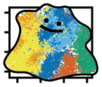
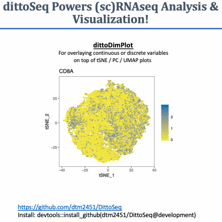

# dittoSeq [](https://doi.org/10.5281/zenodo.2577576)



**A set of functions built to enable analysis and visualization of single-cell and bulk RNA-sequencing data by novice, experienced, and color blind coders**



*For a description of how to use the visualization functions, click [here](Vignette)*

*For a description of how to use the Demuxlet import functions, click [here](Demuxlet-Vignette)*

All plotting functions spit out easy-to-read, color blind friendly, ggplot2 plots upon minimal coding input for your daily analysis needs, and they also allow sufficient manipulations to provide for out-of-the-box submission-quality figures.

Package includes various helper and plotting functions for working with RNAseq data analyzed in other packages; handles data stored in these object types:

- Seurat (v2 & v3), single-cell RNAseq
- SingleCellExperiment, single-cell RNAseq
- DESeq, bulk RNAseq.

Additionally, contains import functions for [Demuxlet](https://github.com/statgen/demuxlet) cell annotations as Mux-seq datasets often consist of side-by-side bulk and single-cell RNAseq.  (If you would like a pipeline for extraction of genotypes from bulk RNAseq to enable Demuxlet-calling of single-cell RNAseq, shoot me an email.)

Extends the visualization functionality of the widely used Seurat package, and allows generation of similar figures from alternatively encoded single-cell data, or bulk RNA sequencing data. Thus, it enables analysis of single cell and bulk data side-by-side.

NOTE: I use this package daily, and am constantly coming up with new ideas for tweaks and additional utility myself.  To report errors, give feedback, or suggest new features, you can do so either through [github](https://github.com/dtm2451/DittoSeq/issues), or by email at <daniel.bunis@ucsf.edu>.

## News:

**Name Change:** I recently changed the package name from DittoSeq to dittoSeq to abide by camelCase package naming, as suggested by Bioconductor.  If you get issues loading the package after an update, you likely just need to change `library(DittoSeq)` to `library(dittoSeq)`.

**Colors Storage:** I also updated how the default colors are stored: The package used to add a `MYcolors` object within the workspace.  Now, the colors can be accessed using a `dittoColors()` function.  If you used  `MYcolors` before in your code, just swap that our for `dittoColors()` after updating.

**New functions updated in the development branch:** (from "old" `DB` version to "new" `ditto` versions)

- dittoDimPlot
- multi_dittoDimPlot
- dittoHeatmap
- dittoPlot
  - Also added Ridgeplot capability & wrappers `dittoRidgePlot()` + `dittoBoxPlot()`
- multi_dittoPlot
- dittoBarPlot
- dittoPlotVarsAcrossGroups (old = DBPlor_multi_var_summary)
- multi_dittoDimPlotVaryCells
- **All plotting functions have now been updated**
  
**Entirely new functions in the development branch:**

- dittoScatterPlot() - allows plotting of gene x gene / metadata x metadata / gene x metadata... scatterplots, with potential to overlay colors or shapes.  Similar to dittoDimPlot, but with more flexible axes.

**Updated vignettes with these functions coming soon.** Hopefully, R documentation (example: `?dittoDimPlot`) can suffice in the meantime.

## Color blindness friendliness:

The default colors of this package are meant to be red-green color blindness friendly.  To make it so, I used the suggested colors from this source: [Wong B, "Points of view: Color blindness." Nature Methods, 2011.](https://www.nature.com/articles/nmeth.1618) and adapted them slightly by appending darker and lighter versions to create a 24 color vector.  All plotting functions use these colors, stored in `dittoColors()`, by default.  Also included is a `Simulate()` function that allows you to see what your function might look like to a colorblind individual.  For more info on that, see my [Colorblindness Compatibility Page](ColorblindCompatibility)

## To install:

Simply run this code:

```
install.packages("devtools")
devtools::install_github("dtm2451/dittoSeq")
```

## Development:

Updated functionality is on the way!  I am currently going through the process of overhauling most dittoSeq visualizations prior to submission to CRAN / Bioconductor.  To test out what's new, check out the development node.

New plotters will be named "ditto"PlottingFunction instead of "DB"PlottingFunction, so installing development versions should not break any old code.  Be warned though that any "ditto"PlottingFunction is subject to change until such time that version 1.0.0 is released.

To install the development version, run:

```
devtools::install_github("dtm2451/dittoSeq@development")
```

# DittoSeq Functions (as of DittoSeq-0.2.06)

## Plotting Functions

For an explanation on how to use the visualization functions, see the vignette [here](Vignette).

**`DBBarPlot()`** = No analogous function currently in Seurat, but incredibly useful! Most common use: Plotting the cluster breakdown of all cells within each sample. Essentially, it is similar to DBPlot, but for discrete variables. Handles plotting of discrete data on a per-sample or per-condition grouping.

**`DBDimPlot()`** = Analogous Seurat functions: TSNEPlot / PCAPlot / DimPlot.  Improves on Seurat functions' capabilities to present continuous (including negative) numerical data, or descrete data (clustering, samples, batches, condition, etc.) in various ways.

**`DBPlot()`** = Analogous Seurat function: VlnPlot. Allows generation of jitter/dot-plot, boxplot, and/or violin-plot representation of numerical data, with order of what's on top easily settable. Data can be expression of particular genes or any numerical metadata like percent.mito, nUMI, and nGene.  Colors and grouping of cells is tunable through discrete inputs.

**`DBHeatmap()`** = Given a set of genes to focus on, outputs a heatmap.  Colors, cell annotations, names, are all tunable with discrete inputs.  Many others are possible as well; this function is a wrapper for pheatmap.

**`DBPlot_multi_var_summary()`** = No analogous function currently in Seurat.  Given a set of genes (like a signature set from a reference dataset, or a set of genes associated with a GO term or pathway), plots expression of all genes in the set across groups of cells/samples.

**multi-plotters** = Plot multiple DBDimPlots or DBPlots in an array.  Can handle most inputs that would be given to the individual functions.  Names are **`multiDBDimPlot()`**, **`multiDBPlot()`**, and **`multiDBDimPlot_vary_cells()`**.

## Color adjustment functions

**`Darken()`**: Darkens a color or color.panel by a given amount. (note: use these on a color.panel, not on a generated plot)

**`Lighten()`**: Lightens a color or color.panel by a given amount. (note: use these on a color.panel, not on a generated plot)

**`Simulate()`**: Generates any of the plot-types included in this package with colors adjusted to simulate any of the major forms of colorblindness.

## Helper functions

These make manipulating Seurat data, and using my plotting functons, easier.

**`get.metas()`**, **`get.genes()`**, and **`get.reductions()`**: Returns the list of meta.data slots, the list of genes, or the names of dimensional reduction slots that exist in the dataset.  Works exactly like typing `names(object@meta.data)` or `rownames(object@data)` or `names(object@dr)` for a Seurat.v2 object, only easier and adapts to the object type.

**`is.meta()`** and **`is.gene()`**: Returns TRUE or FALSE for whether a "meta.data" or "gene" input is part of the dataset.  Both work for testing multiple queries at once as well.

**`meta()`**, **`gene()`**, and **`var_OR_get_meta_or_gene()`**: Returns the values of a meta.data for every cell or the expression data for all cells.  meta() and gene() are specific to one type. var_OR_get_meta_or_gene can be used to retrieve either type.

**`meta.levels()`**: Returns the range of values of metadata. Like running `levels(as.factor(object@meta.data$meta))`. Alternatively, can reurn the counts of each value of the meta.data is the optional input `table.out = TRUE` is set given.

**`extDim()`**: extracts the loadings of each cell for a given dimensional reduction space.  The output has 2 slots: `$embeddings` = the loadings of each cell, `$name` = the suggested way of naming this reduction in text or as an axis of a plot.

**`grab_legend()`**: Extracts and plots the legend from a ggplot

**`remove_legend()`**: Replots a ggplot without its legend.

## Demuxlet functions

For an explanation of the Demuxlet import functions, click [here](Demuxlet-Vignette)

**`ImportDemux2Seurat()`** - Imports demuxlet info into a pre-made Seurat object.

**`demux.calls.summary()`** - Makes a plot of how many calls were made per sample, separated by the separate lanes.

**`demux.SNP.summary()`** - Creates a plot of the number of SNPs per cell.

