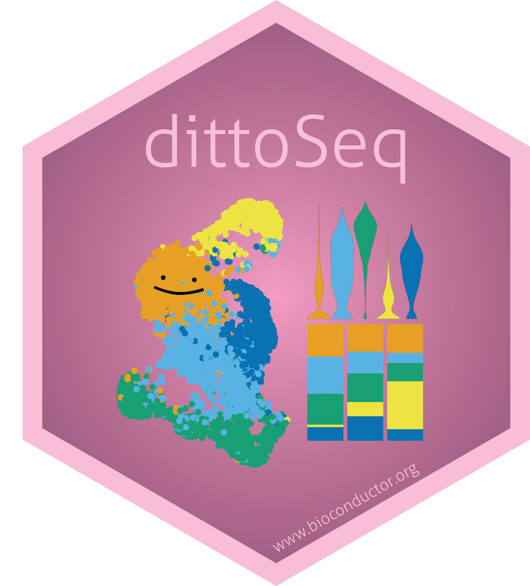
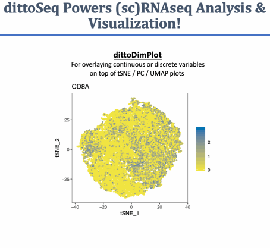
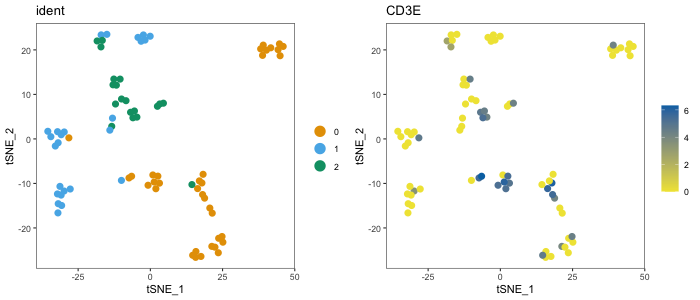
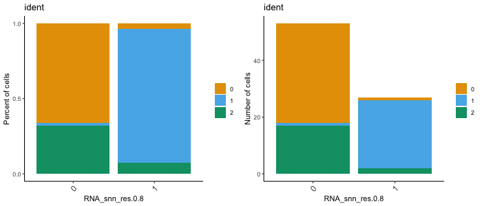
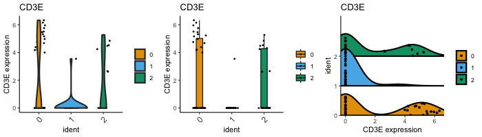
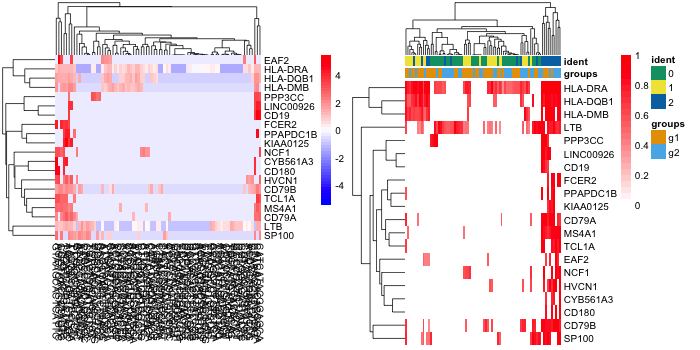
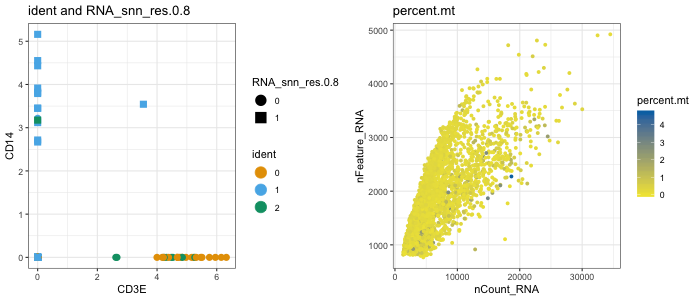
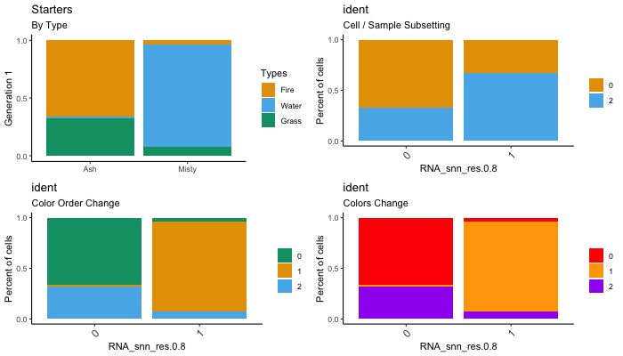

#  dittoSeq 

**A set of functions built to enable analysis and visualization of single-cell and bulk RNA-sequencing data by novice, experienced, and color blind coders**

dittoSeq includes universal plotting and helper functions for working with (sc)RNAseq data processed in these packages:

- single-cell:
  - Seurat (versions 2 & 3), *Seurat* data structure
  - scran / scater / other Bioconductor packages that utilize the *SingleCellExperiment* data structure
- bulk:
  - edgeR, *DGEList* data structure
  - DESeq2 / other Bioconductor packages that utilize the *SummarizedExperiment* data structure
  
All plotting functions spit out easy-to-read, color blind friendly, plots (ggplot2, plotly, or pheatmap) upon minimal coding input for your daily analysis needs, yet also allow sufficient manipulations to provide for out-of-the-box submission-quality figures!

dittoSeq also makes access of underlying data easy, for submitting to journals or for adding extra layers to the plot, with `data.out = TRUE` inputs!



### News: Updates in dittoSeq v1.2:

- Added 3 New Visualization Functions, `dittoDotPlot()`, `dittoDimHex()` & `dittoScatterHex()`.
- Expanded SummarizedExperiment compatibility across the entire toolset.
- Added ComplexHeatmap integration to `dittoHeatmap()`, controlled by a new input, `complex`.
- Added Rasterization for improved image editor compatibility of complex plots. (See the dedicated section in the vignette for details.)
- Added `labels.split.by` input & `do.contour`, `contour.color`, and `contour.linetype` inputs to scatter/dim-plots.
- Added `order` input to scatter/dim-plots for control of plotting order.
- Added `metas` input for displaying such data with `dittoHeatmap()`.
- Added `adjustment` input to `meta()`, which works exactly as in `gene()` (but this is not yet implemented within data grab of visualization functions).
- Added `adj.fxn` input to `meta()` and `gene()` for added control of how data might be adjusted (but this is not yet implemented within data grab of visualization functions).
- Replaced (deprecated) `highlight.genes` input with `highlight.features` in `dittoHeatmap()`.
- Replaced (deprecated) `OUT.List` input with `list.out` for all `multi_*` plotters.

### Color Blindness Compatibility:

The default colors of this package are meant to be color blind friendly.  To make it so, I used the suggested colors from this source: [Wong B, "Points of view: Color blindness." Nature Methods, 2011](https://www.nature.com/articles/nmeth.1618) and adapted them slightly by appending darker and lighter versions to create a 24 color vector. All plotting functions use these colors, stored in `dittoColors()`, by default. Also included is a Simulate() function that allows you to see what your function might look like to a colorblind individual. For more info on that, see the [Color blindness Friendliness section below](#color-blindness-friendliness)

### Demuxlet Tools

Included in this package currently are a set of functions to facilitate Mux-seq applications. For information about how to use these tools, see the [Demuxlet section down below](#demuxlet-tools). For more information on Demuxlet and Mux-sequencing, see the [Demuxlet GitHub Page](https://github.com/statgen/demuxlet). (Impetus: Many Mux-seq experiments will involve generating the side-by-side bulk and single-cell RNAseq data like the rest of the package is built for.)

## Installation:

```
### For R-4.0 users:
if (!requireNamespace("BiocManager", quietly = TRUE))
    install.packages("BiocManager")

BiocManager::install("dittoSeq")

### For users with older versions of R:
# BiocManager will not let you install the pre-compiled version, but you can
# install directly from this GitHub via:
if (!requireNamespace("devtools", quietly = TRUE))
    install.packages("devtools")

devtools::install_github("dtm2451/dittoSeq")
```

# Quick Start Guide:

Load in your data, then go!:

```
library(dittoSeq)

# dittoSeq works natively with Seurat, SingleCellExperiment (SCE),
#   & SummarizedExperiment (SE) objects

# Seurat
seurat <- Seurat::pbmc_small
dittoPlot(seurat, "CD14", group.by = "ident")

# SingleCellEXperiment
sce <- Seurat::as.SingleCellExperiment(seurat)
dittoDimPlot(sce, "CD14")

# SummarizedExperiment
# (Please excuse the janky setup code for this quick example.)
library(SummarizedExperiment)
se <- as(as.SingleCellExperiment(Seurat::pbmc_small), "SummarizedExperiment")
rownames(se) <- rownames(sce)
dittoBarPlot(sce, "ident", group.by = "RNA_snn_res.0.8")

# For working with non-SE bulk RNAseq data, first import your data into a
#   SingleCellExperiment structure, (which is essentially a SummarizedExperiment
#   structure just with an added space for holding dimensionality reductions).
# myRNA <- importDittoBulk(dds) # DESeq2
# myRNA <- importDittoBulk(dgelist) # edgeR
# Then add dimensionality reductions
# myRNA <- addDimReduction(myRNA, embeddings, "pca")
#   above, embeddings = the dim-reduction matrix
myRNA <- example("importDittoBulk")

# You're ready!
dittoDimPlot("gene1", myRNA, size = 3)
```

Quickly determine the metadata and gene options for plotting with universal helper functions:

```
getMetas(seurat)
isMeta("nCount_RNA", seurat)

getGenes(myRNA)
isGene("CD3E", myRNA)

getReductions(sce)

# View them with these:
gene("CD3E", seurat, assay = "RNA", slot = "counts")
meta("groups", seurat)
metaLevels("groups", seurat)
```

### There are many dittoSeq Plot Types

**Intuitive default adjustments generally allow creation of immediately useable plots.**

```
# dittoDimPlot
dittoDimPlot(seurat, "ident", size = 3)
dittoDimPlot(seurat, "CD3E", size = 3)
```



```
# dittoBarPlot
dittoBarPlot(seurat, "ident", group.by = "RNA_snn_res.0.8")
dittoBarPlot(seurat, "ident", group.by = "RNA_snn_res.0.8",
    scale = "count")
```



```
# dittoPlot
dittoPlot(seurat, "CD3E", group.by = "ident")
dittoPlot(seurat, "CD3E", group.by = "ident",
    plots = c("boxplot", "jitter"))
dittoPlot(seurat, "CD3E", group.by = "ident",
    plots = c("ridgeplot", "jitter"))
```



```
# dittoHeatmap
dittoHeatmap(seurat, genes = getGenes(seurat)[1:20])
dittoHeatmap(seurat, genes = getGenes(seurat)[1:20],
    annot.by = c("groups", "nFeature_RNA"),
    scaled.to.max = TRUE,
    treeheight_row = 10)
# Turning off cell clustering can be necessary for large scRNAseq data
# Thus, clustering is turned off by default for single-cell data, but not for
# bulk RNAseq data.
# To control ordering/clustering separately, use 'order.by' or 'cluster_cols'
## (Not shown) ##
dittoHeatmap(seurat, genes = getGenes(seurat)[1:20],
    order.by = "groups")
dittoHeatmap(seurat, genes = getGenes(seurat)[1:20],
    cluster_cols = FALSE)
```



```
# dittoScatterPlot
dittoScatterPlot(
    object = seurat,
    x.var = "CD3E", y.var = "nCount_RNA",
    color.var = "ident", shape.by = "RNA_snn_res.0.8",
    size = 3)
dittoScatterPlot(
    object = seurat,
    x.var = "nCount_RNA", y.var = "nFeature_RNA",
    color.var = "CD3E",
    size = 1.5)
```



```
# Also multi-plotters:
    # multi_dittoDimPlot (multiple, in an array)
    # multi_dittoDimPlotVaryCells (multiple, in an array, but showing only
    #     certain cells in each plot)
    # multi_dittoPlot (multiple, in an array)
    # dittoPlot_VarsAcrossGroups (multiple genes or metadata as the jitter
    #     points (and other representations), summarized across groups by
    #     z-score, or mean, or median, or any function that outputs a
    #     single numeric value from a numeric vector input.)
```

**Many adjustments can be made with simple additional inputs:**

dittoSeq allows many adjustments to how data is represented via inputs directly within dittoSeq functions.
Adjustments that are common across functions are briefly described below.
Some others are within the examples above.

For more details, review the full vignette (`vignette("dittoSeq")` after installation via Bioconductor)
and/or the documentation of individual functions (example: `?dittoDimPlot`).

Common Adjustments:

- All Titles are adjustable.
- Easily subset the cells shown with `cells.use`
- Colors can be adjusted easily.
- Underlying data can be output.
- plotly hovering can be added.
- Many more! (Legends removal, label rotation, labels' and groupings' names, ...)

```
# Adjust titles
dittoBarPlot(seurat, "ident", group.by = "RNA_snn_res.0.8",
    main = "Starters",
    sub = "By Type",
    xlab = NULL,
    ylab = "Generation 1",
    x.labels = c("Ash", "Misty"),
    legend.title = "Types",
    var.labels.rename = c("Fire", "Water", "Grass"),
    x.labels.rotate = FALSE)

# Subset cells / samples
dittoBarPlot(seurat, "ident", group.by = "RNA_snn_res.0.8",
    cells.use = meta("ident", seurat)!=1)

# Adjust colors
dittoBarPlot(seurat, "ident", group.by = "RNA_snn_res.0.8",
    colors = c(3,1,2)) #Just changes the color order, probably most useful for dittoDimPlots
dittoBarPlot(seurat, "ident", group.by = "RNA_snn_res.0.8",
    color.panel = c("red", "orange", "purple"))
```



```
# Output data
dittoBarPlot(seurat, "ident", group.by = "RNA_snn_res.0.8",
    data.out = TRUE)

# Add plotly hovering
dittoBarPlot(seurat, "ident", group.by = "RNA_snn_res.0.8",
    do.hover = TRUE)
```

# Color-blindness Friendliness

dittoSeq has many methods to make its plots color-blindness friendly:

### 1. The default color palette is built to work for the most common forms of colorblindness.

I am a protanomalous myself (meaning I am red-green impaired, but more red than green impaired), so I chose colors for dittoSeq that I could tell apart. These colors also work for deuteranomolies (red-green, but more green than red) the most common form of color-blindness.

Note: There are still other forms of colorblindness, tritanomaly (blue deficiency), and complete monochromacy. These are more rare. dittoSeq's default colors are not great for these, but 2 & 3 below can still help!

### 2. Color legend point-sizing is large by default

No color panel can be perfect, but when there are issues, being able to at least establish some of the color differences from the legend helps. For this goal, having the legend examples be large enough is SUPER helpful.

### 3. Lettering overlay

Once the number of colors being used for discrete plotting in `dittoDimPlot` gets too high for even a careful color panel to compensate, letters can be added to by setting `do.letter = TRUE`.

### 4. Shape.by

As an alternate to letting (do.letter & shape.by are incompatible with each other), distinct groups can be displayed using different shapes as well.

### 5. Interactive Plots

Many dittoSeq visualizations offer plotly conversion when a `do.hover` input is set to `TRUE`. Making plots interactive is another great way to make them accessible to individuals with vision impairments. I plan to build such plotly conversion into more functions in the future.

### 6. The **`Simulate`** function

This function allows a cone-typical individual to see what their dittoSeq plot might look like to a colorblind individual.  This function works for all dittoSeq visualizations currently, except for dittoHeatmap.

Note: there are varying degrees of colorblindness. `Simulate` simulates for the most severe cases.

Say this is the code you would use to generate your plot:

```
dittoDimPlot("CD3E", object = seurat, do.letter=F)
```

The code to visualize this as if you were a deuteranope like me is:

```
Simulate(type = "deutan", plot.function=dittoDimPlot, "CD3E", object = seurat, do.letter=F)
```

The Simulate() function's inputs are:

- `type` = "deutan", "protan", "tritan" = the type of colorblindness that you want to simulate.  Deuteranopia is the most common, and involves primarily red color deficiency, and generally also a bit of green.  Protanopia involves primarily green color deficiency, and generally also a bit of red.  Tritanopia involves primarily blue color deficiency.
- `plot.function` = the function you want to use.  R may try to add `()`, but delete that if it does.
- `...` = any and all inputs that go into the plotting function you want to use.

# Demuxlet tools

Included in this package are a set of functions to facilitate Mux-seq applications. For more information on Demuxlet and Mux-sequencing, see the [Demuxlet GitHub Page](https://github.com/statgen/demuxlet). (Impetus: Many Mux-seq experiments will involve generating the side-by-side bulk and single-cell RNAseq data like the rest of the package is built for.)

- **`importDemux()`** - imports Demuxlet info into a pre-made Seurat or SingleCellExperiment object. For more info on its use, see below and `?importDemux` within R.

-	**`demux.calls.summary()`** - Makes a plot of how many calls were made per sample, separated by the separate lanes.  This is very useful for checking the potential accuracy of sample calls when only certain samples went into certain lanes/pools/sequencing runs/etc.  (Note: the default setting is to only show Singlet calls.  Use `singlets.only = FALSE` to include *one of the sample calls* for any doublets.

```
demux.calls.summary(object)
```

-	**`demux.SNP.summary()`** - Useful for checking if you have a lot of cells with very few SNPs. Creates a plot of the number of SNPs per cell that is grouped by individual lane by default.  This function is a simple wrapper for dittoPlot() function with var="demux.N.SNP" and with a number of input defaults adjusted (such as group.by and color.by = "Lane" so that the grouping is done according to 'Lane' metadata.)

```
demux.SNP.summary(object)
```

### `importDemux()` Function:

You will need to point the function to:

- `object` = the target Seurat/SCE object
- `demuxlet.best` = the location(s) of your Demuxlet .best output files.

If your data comes from multiple droplet-gen lanes, then there are two main distinct ways to use the function.

They differ because of specifics of how the data from distinct lanes may have been combined.
See `?importDemux` in R for suggested usage.

#### Metadata created by **`importDemux`**:

Metadata slot name | Description OR the Demuxlet.best column name if directly carried over
--- | ---
Lane | guided by lane.names input, represents of separate droplet-generation lanes, pool, sequencing lane, etc.
Sample | The sample call, from the BEST column
demux.doublet.call | whether the sample was a singlet (SNG), doublet (DBL), or ambiguous (AMB), from the BEST column
demux.RD.TOTL | RD.TOTL
demux.RD.PASS | RD.PASS
demux.RD.UNIQ | RD.UNIQ
demux.N.SNP | N.SNP
demux.PRB.DBL | PRB.DBL
demux.barcode.dup | (Only generated when TRUEs will exist, indicative of a technical issue in the bioinformatics pipeline) whether a cell's barcode referred to only 1 row of the .best file, but multiple distinct cells in the dataset.

#### Summary output:
The import function spits out a quick summary of what was done, which will look something like this:

```
Adding 'Lane' information as meta.data
Extracting the Demuxlet calls
Matching barcodes
Adding Demuxlet info as metadata
Checking for barcode duplicates across lanes...
  No barcode duplicates were found.

SUMMARY:
2 lanes were identified and named:
  Lane1, Lane2
The average number of SNPs per cell for all lanes was: 505.3
Out of 80 cells in the Seurat object, Demuxlet assigned:
    75 cells or 93.8% as singlets
    4 cells or 5% as doublets
    and 1 cells as too ambiguous to call.
0 cells were not annotated in the demuxlet.best file.
```
