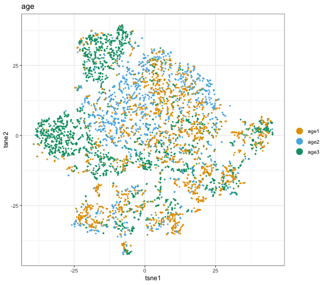
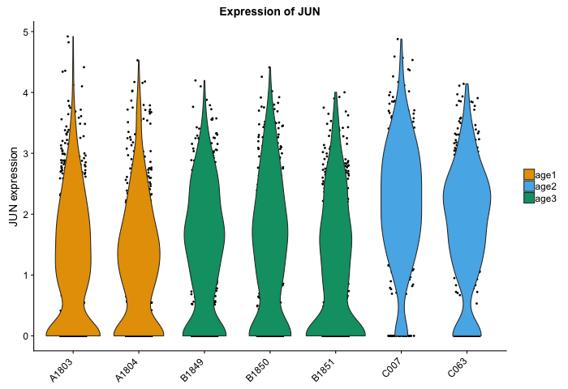
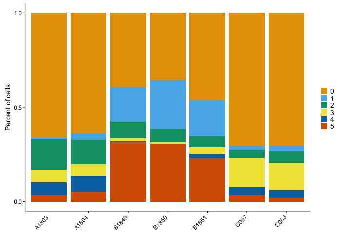
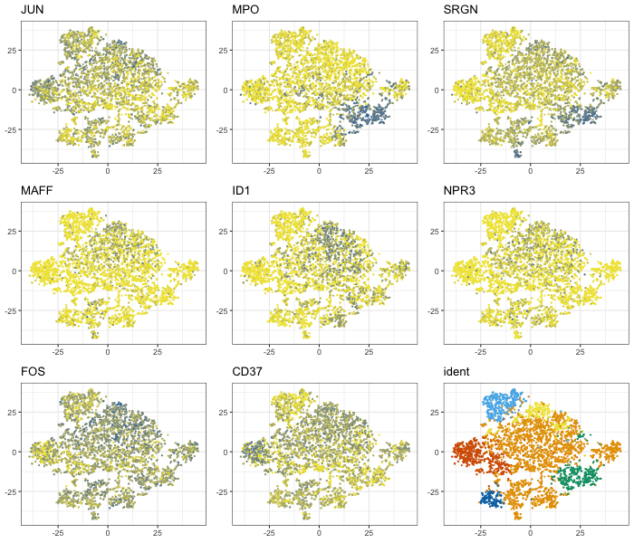
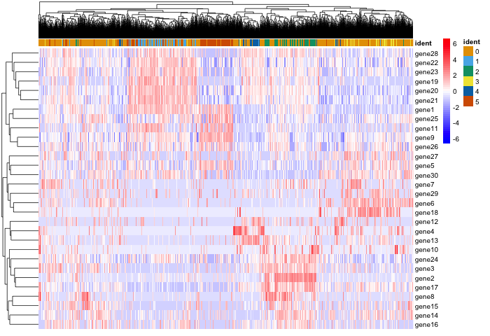
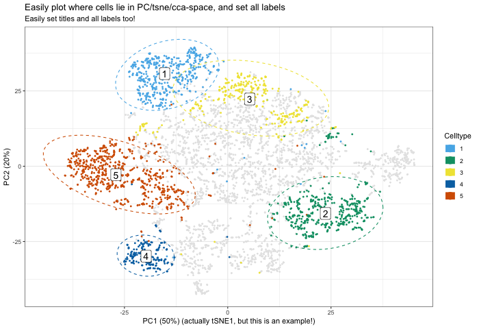
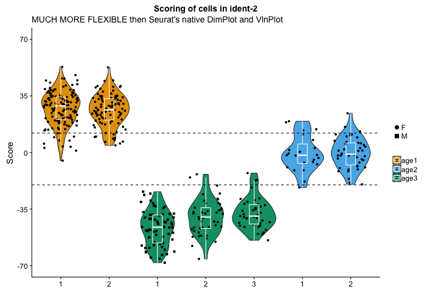
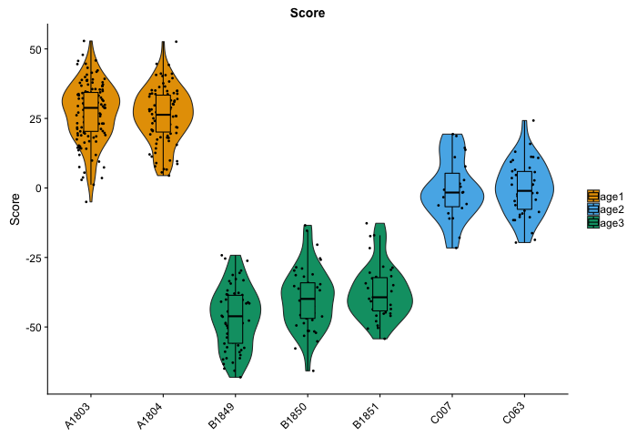
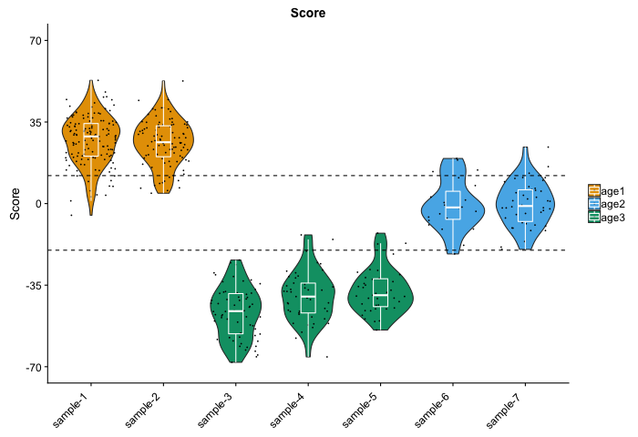

# DittoSeq Vignette

Below is a demonstration of the power of DittoSeq's functions for exploring (sc)RNAseq data and creating publication-ready functions with descriptions of all tweakable inputs.  **For a play-along tutorial, you can download this pre-processed [public scRNAseq data, 272MB](https://ucsf.box.com/s/3lwwwingjinshfj69y3diyhaoa1b5b6w) and follow this [commented code](pbmc_3k_code-examples.R)**

DittoSeq.R includes various helper and plotting functions for working with RNAseq data. All plotting functions spit out easy-to-read, color blind friendly, ggplot plots upon minimal coding input for your daily analysis needs, and they also allow sufficient manipulations to provide for out-of-the-box submission-quality figures.

In addition to significantly extending visualization functionality of the widely used Seurat package for single cell RNAseq data, the package allows generation of similar figures from bulk RNA sequencing data. Thus, it enables analysis of single cell and bulk data side-by-side. To do so, the package establishes an S4 structure object for bulk RNA sequencing data that is similar to the [Seurat](https://satijalab.org/seurat/) data structure. I will describe that furthur in a separate vignette. Currently, bulk capabilities only extend to bulk data that has been analyzed in DESeq, but I plan to add functionality for edgeR in the near future. I will add more information about handling bulk data with these functions at that time.

NOTE: I use this package daily, and am constantly coming up with new ideas for tweaks and additional utility myself.  To report errors, give feedback, or suggest new features, you can do so either through [github](https://github.com/dtm2451/DittoSeq), or by email at <daniel.bunis@ucsf.edu>.

## Colors:

The default colors of this package are color blind friendly.  Source: [Wong B, "Points of view: Color blindness." Nature Methods, 2011.](https://www.nature.com/articles/nmeth.1618)  Currently, when you source my package into your workspace, a variable called MYcolors is created that has the 8 colors refenced in the Points of View paper stored inside.  Lighter and darker versions of these same colors are then appended to make it a 24 color vector.

## Installation.

```
devtools::install_github("dtm2451/DittoSeq")
```

## Plotting Functions

**DBDimPlot** = handles all needs for Seurat TSNEPlot / PCAPlot / DimPlot functions.  Improves on the Seurat functions' capabilities to present continuous (including negative) numerical data, or descrete data (clustering, samples, batches, condition, etc.) in various ways.

**DBPlot** = handles needs of Seurat's VlnPlot function. Allows generation of jitter/dot-plot, boxplot, and/or violin-plot representation of numerical data, with order of what's on top easily settable. Data can be expression of particular genes or any numerical metadata like percent.mito, nUMI, and nGene.  Colors and grouping of cells is tunable through discrete inputs.

**DBBarPlot** = No analogous function currently in Seurat.  Handles plotting of discrete data on a per-sample or per-condition grouping. Essentially, it is similar to DBPlot, but for discrete variables. Example: cluster makeup of a sample.

**`DBHeatmap()`** = Given a set of genes to focus on, outputs a heatmap.  Colors, cell annotations, names, are all tunable with discrete inputs.  Many others are possible as well; this function is a wrapper for pheatmap.

**multiDBPlot**, **multiDBDimPLot**, and **multiDBDimPLot_vary_cells** = Plots multiple DBDimPlots or DBPlots in an array.  Can handle most inputs that would be given to the individual functions.

### Basic use

The basic use of most functions, including all of the plotting functions is `function(var, object, other.inputs)` where var is the target variable (often this will be the "name" of a metadata or gene) and object is the Seurat-object target.  One of the most useful other inputs is probably cells.use.

**`var`** - When var is given as a string name of a gene or metadata, default plot titles are generally generated and the functions will automatically grab the relevant values to plot.  A discrete vector can also be provided, but note that even if cells.use is going to be used to subset down to only certain cells, this vector must include data for all the cells.

**`object`** - Object is the Seurat or RNAseq-class the function should call on.  It can be entered in any of 3 ways:

- the actual object
- "quoted" name of the object
- or left out completely after setting `DEFAULT <- "object"`

**`DEFAULT`** - Every function in DittoSeq has `object = DEFAULT` as it's default setup. Thus, if you do not provide an `object` input, it will look for a variable named DEFAULT within your workspace. Try this: Store your quoted object name as a variable named DEFAULT, code = `DEFAULT <- "object"`, to skip the object input altogether! For example, if I start by running `DEFAULT <- "HSPCs"`, then a t-SNE plot with datapoints colored by their age can be generated with just `DBDimPlot("age")` rather than with `DBDimPlot("age","HSPCs")`.

Other Required Inputs, **`group.by` and `color.by`** - DBBarPlot(var, object, group.by) and DBPlot(var, object, group.by, color.by) have 1 and 2 other required inputs.  For both, group.by is required in order to set the x axis groupings.  For DBPlot, color.by is required as well for setting the fill color of the violin-plotting or box-plotting.  The inputs for each of these variables are the "quoted" name of a meta.data of the object.  These should be whatever metadata you wish to have the data grouped by / colored by.

`multiDBDimPlot()` and `multiDBPlot()` require the same inputs as their individual plot counterparts, and can handle all the same additional manipulations.  Extra inputs `ncol` and `nrow` allow you to set the spacing of your plots.

`multiDBDimPlot_vary_cells()` requires additional input `cells.use.meta` for determining how to vary cells. Additional input `cells.use.levels` is used, instead of the `cells.use` input of all other functions, for determining which cell groupings to cycle through.

#### Basic use examples

```
#DBDimPlot: Makes a DBDimPlot showing a discrete variable, age, of all cells.
DBDimPlot("age", "HSPCs")

#Set DEFAULT
DEFAULT <- "HSPCs" #After setting this, the object slot can be left out entirely!

#The same DBDimPlot, but allowing it to find "HSPCs" when it looks for DEFAULT.  == SIMPLER TYPING
DBDimPlot("age")

#And making a multiDBDimPlot is just as simple.
multiDBDimPlot(var = c("JUN","MPO","SRGN","MAFF","ID1","NPR3","FOS","CD37","ident"))

#DBPlot: Makes a DBPlot showing the per cell expression of JUN of each sample with coloring based on age
DBPlot("JUN", group.by = "Sample", color.by = "age")

#DBBarPlot: Makes a DBBarPlot showing the clustering percentages broken down by Sample
DBBarPlot("ident", group.by = "Sample")
```







### Intuitive inputs

"ident" = If "ident" is provided as the `var` then all functions will look for `object@ident`, which is where clustering gets stored in a Seurat object.

"gene-name" or "meta-name" = If a character string is provided that is not "ident", then helper functions is.meta() and is.gene() will be called to determine how to proceed. If the "quoted" name of a metadata slot is given as `var`, then `object@meta.data$var` will be used.  If the "quoted" name of a gene is given as `var`, then `object@data[gene,]` will be used.

```
DBDimPlot("ident") # use this to plot the currently stored clustering of your cells.
DBDimPlot("age") # if you give the name of a meta.data slot, that meta.data will automatically be pulled.
DBDimPlot("CD34") # if you give the name of a gene, expression data of that gene will pautomatically be pulled.
```

### Useful Manipulations Examples

A couple examples before jumping in, to showcase the flexible functionality:

```
DBDimPlot("ident",
          main = "Easily plot where cells lie in PC/tsne/cca-space, and set all labels",
          sub = "Easily set titles and all labels too!",
          xlab = "PC1 (50%) (actually tSNE1, but this is an example!)",
          ylab = "PC2 (20%)",
          legend.title = "Celltype",
          do.label = T,
          ellipse = T,
          cells.use = meta("ident")!="0",
          colors = c(2:8))
DBPlot("Score",
       group.by = "Sample",
       color.by = "age",
       shape.by = "Sex",
       plots = c("vlnplot","jitter","boxplot"),
       cells.use = meta("ident")=="2",
       labels = c("1", "2", "1", "2", "3", "1", "2"),
       rotate.labels = F,
       jitter.size = 1.5,
       boxplot.color = "white",
       boxplot.fill = F,
       y.breaks = c(-70, -35, 0, 35, 70),
       hline = c(12, -20),
       jitter.width = 0.35,
       main = "Scoring of cells in ident-2",
       sub = "MUCH MORE FLEXIBLE then Seurat's native DimPlot and VlnPlot"
)
```




### Key advanced inputs:

**`cells.use`, `show.others`** = in DBPlot (cells.use only) and DBDimPlot (both), for showing or highlighting only certain cells. `cells.use` input is used for either showing/highlighting only certain cells with DBPlot and DBDimPlot. For example, only 3s below.  In DBDimPlot, non-target cells will still be shown, by default, as light grey dots. `show.others = F` is an optional additional input for DBDimPlot which can be used to turn off the inclusion of other cells. Usage = For cells.use, provide either the list of cell.names subsetted to just the ones you want (the same way it is used in Seurat), OR provide a logical that says whether each cell should be included (a.k.a. `THIS` in: `object@cell.names[THIS]`). For show.others, use either TRUE or FALSE.

```
# Using the list of cell names method:
DBPlot("Score", group.by = "Sample", color.by = "age",
       cells.use = HSPCs@cell.names[meta("ident")=="3"])
# Using the logical method:
DBDimPlot("age",
          cells.use = meta("ident")=="3")
# Removing the gray 'others' dots.
DBDimPlot("age",
          cells.use = meta("ident")=="3",
          show.others = F)
```

**`do.hover`, `data.hover`** = DBDimPlot only currently.  I added ggplotly data hover compatibility.  If you want to quickly learn more about a certain data point, set do.hover = TRUE and data.hover = c("meta-data1", "gene1","meta-data2", "gene2") where you repllace those with the names of whatever metadata or gene expression data you want to show when you hover your cursor over the plot.  Notes: do.hover=TRUE is incompatibile with the do.letter option, so it will turn letting (described below) off.

**`do.label`, `label.size`, `highlight.labels`** = in DBDimPlot, for labeling clusters / ages / conditions / any discrete classifier of the cells in the dataset.  Setting `do.label = TRUE` turns on labeling. `label.size = 10` adjusts the label size. `highlight.labels = TRUE` controls whether there will be a white box around the labels.  Default are label.size = 5, and highlight.labels = TRUE

**`ellipse`** = in DBDimPlot, whether an ellipse should be drawn to help orient the clustering of certain groups when plotting discrete variables. Usage: `ellipse = TRUE`

```
# Using the default labeling
DBDimPlot("ident", do.label = T)
# Adding in ellipses
DBDimPlot("ident", do.label = T, ellipse = T)
# Adjusting the label size and removing the highlight/background
DBDimPlot("ident", do.label = T, label.size = 10, highlight.labels = F)
```

**`reduction.use`, `dim.1`, `dim.2`** = in DBDimPlot, for setting which dimensional reduction space and dimensions to use. Usage = For reduction.use, provide the all lowercase, quoted, key for the target dr space of the object (`object@dr$"THIS"`), a.k.a. "tsne", "pca", "ica", "cca", "cca.aligned". For dim.1 and dim.2 provide the component #, like 1 and 2 for PC1 and PC2.  dim.1 sets the x-axis and dim.2 sets the y-axis, just like in Seurat's DimPlot functions.

```
# Switching to cca instead of the default, tsne.
DBDimPlot("ident", reduction.use = "cca.aligned", dim.1 = 1, dim.2 = 2)
```

**`main`, `sub`, `xlab`, `ylab`, `legend.title`** = These set the titles for the plot, `main` and `sub`, for the axes, `xlab` and `ylab`, and `legend.title` for the legend.  Except for `legend.title` which is currently only used in DBDimPlot, all others work for all my plotting functions.

```
# Adjusting all titles
DBDimPlot("ident", reduction.use = "cca.aligned", dim.1 = 1, dim.2 = 2,
          main = "Where cells lie in CCA-space",
          sub = "After CCA-alignment",
          xlab = "CC1",
          ylab = "CC2",
          legend.title = "Celltype")
```

**`plots`** = in DBPlot, this input is used to set the order of data plotting. Options are "vlnplot" for making violin plots, "boxplot" for making box plots, and "jitter" (dot plotting with random spread added in the x direction for visualization).  Usage = `plots = c("vlnplot", "boxplot", "jitter")`. The order that these options are given sets the bottom to top order that they will be plotted.  So actually giving `c("vlnplot", "boxplot", "jitter")` will put the violin plots on the bottom, with a boxplot on top of that and the jitter plotting on the top layer.  Default: plots = c("jitter","vlnplot") as I have found this to be most useful for 10,000+ cell datasets.

```
# This default plotting code...
DBPlot("Score", group.by = "Sample", color.by = "age", cells.use = meta("ident")=="3")
# ...will produce the same plot as:  (jitter plot behind a violin plot)
DBPlot("Score", group.by = "Sample", color.by = "age", cells.use = meta("ident")=="3",
       plots = c("jitter", "vlnplot"))
# Changing the order and adding a boxplot in the middle: (violin plot in the back,
#  boxplot on top of that, jitter on top) 
DBPlot("Score", group.by = "Sample", color.by = "age", cells.use = meta("ident")=="3",
       plots = c("vlnplot", "boxplot", "jitter"))
```

**`color.panel`, `colors`** for setting the colors to be used. Default = a colorblind friendly colorset, stored to `MYcolors` upon source'ing, with 8 main colors that I then darken and lighten to give 24 default colors total.  Credit for the initial 8 goes to Wong, B. “Points of view: Color blindness” Nature Methods, 2011.  `color.panel` sets the color options, and `colors` can be used to adjust which colors are used for what data.  Usage: `color.panel = c("black","white","gray","blue")`. The default for all plotting functions is `color.panel = MYcolors`. `colors = c(8,2:7)` if the 8th color in the color.panel is actually wanted for the first grouping. The default for all plotting functions is `colors = c(1:length(color.panel))`.

```
#Default of DBDimPlot("ident") is the same as
DBDimPlot("ident", color.panel = MYcolors, colors = c(1:8))
#But if I wanted to change the 0s to black (slot 8) I use 8,2,3,4,5,6,7 instead...
DBDimPlot("ident", colors = c(8,2:7))
```

**`do.letter`** = in DBDimPlot, for setting whether dots are annotated with letters to aid in identification.  If set to TRUE, will always happen.  If set to false, will not happen.  If left as the default (NA), then letters will be added if the number of groups is 8 or more.  Note: incompatible with setting the shapes to me different, so if a metadata slot is given to `shape` (described in the next section) do.letter will overrule that input. Also, ggplotly is not compatible this lettering option. do.hover = TRUE will override do.letter = T (and then will allow shape = "metadata" to work!)

```
#To add letters
DBDimPlot("ident", do.letter = T)
#To turn off automatically lettering when there are many groups:
DBDimPlot("ident", do.letter = F)
```

**`shape` / `shape.by`, `shapes` / `jitter.shapes`** = in DBDimPlot and DBPlot respectively. *shape.by* in DBPlot acts exactly like `color.by` except that instead of setting the fill colors for `plots = "vlnplot"` or `"boxplot"`, it sets the shaping used for `plot = "jitter"`.  Usage = provide the "quoted" name of a metadata that has the discrete options you are looking to have shapes be set by.  *shape* works very similarly in DBDimPlot except that it changes the shapes of the dots in the dimplot AND in that it can additionally be used to change the shape of all dots by simply setting it to a different number corresponding to a ggplot shape from the defult 16 (= filled circles). Usage = `shape = 16` OR `shape = "meta-name"`. *shapes* and *jitter.shapes* provides the set of shapes that should be used. For a list of possibilities, see here <https://www.rstudio.com/wp-content/uploads/2015/03/ggplot2-cheatsheet.pdf>. Default: `shapes=c(16,15,17,23,25,8)` and same for `jitter.shapes=c(16,15,17,23,25,8)`.

```
DBPlot("Score", group.by = "Sample", color.by = "age",
       cells.use = (meta("ident")=="4" | meta("ident")=="2"),
       plots = c("vlnplot", "jitter"),
       shape.by = "ident")
# To reverse the shapes, change the order of jitter.shapes (default was c(16,15,17,23,25,8))
DBPlot("Score", group.by = "Sample", color.by = "age",
       cells.use = (meta("ident")=="4" | meta("ident")=="2"),
       plots = c("vlnplot", "jitter"),
       shape.by = "ident",
       jitter.shapes = c(15,16))
```

**`min`, `max`** = in DBPlot, min and max set the limits of the y axis. In DBDimPlot, min and max set the cutoffs for what goes into the color scale for continuous data.  One or both can be used.  If only one is used, the limits of the data will still be used for setting the other extent.  In many cases, for displaying raw bulk RNAseq data, it can be good to set the min to zero.  Note: If values exist that are below min, or above max, in in a DBDimPlot, you will not be able to tell as they will be assigned the min.color or max.color

**`min.color`, `max.color`** = in DBDimPlot, these set the colors used in the color scale when showing continuous data. `min.color` or `max.color` = "quoted" color name, e.g. "blue", or "quoted" hex code color representation, e.g. "#F0E442".  Defaults are yellow -> blue.

**`data.type`** = when showing gene expression, this sets what type of data will be grabbed. Options are: "raw", "normalized", "scaled", and "relative".  "raw" = the @raw.data slot for a Seurat object or the raw @counts slor for an RNAseq object. "normalized" will use the log noralized @data slot for a Seurat object, or the regularized log normalized @data slot of an RNAseq object. "scaled" will pull the scaled & variable regressed out data of a Seurat object (Warning: this is often only calculated for a subset of genes) and will give an error for RNAseq data because it is not calculated, what you'd want is what you get with "relative".  "relative" will use the normalized data, but it will be run through the scale function first to make it relative to the mean of the the expression accross the entire dataset.  

```
# Adjusting the range and colors of a DBDimPlot
DBDimPlot("Score", cells.use = meta("ident")=="3",
          range = c(-20,10), low = "grey", high = "red")
          
# Adjusting the y.min / y.max of DBPlot
DBPlot("Score", group.by = "Sample", color.by = "age", cells.use = meta("ident")=="3",
       plots = c("vlnplot", "boxplot", "jitter"),
       y.min = -40,
       y.max = 50)

# Showing the raw data of a set of genes, with all y axes starting at 0
multiDBPlot(c("CD4","IL7R","ANXA1","SELL","IL4","CD69"),
            object = "bulkCD4", group.by = "Age", color.by = "Age",
            plots = c("boxplot","jitter"),
            y.min = 0)
```

**`theme`** = If you would like to use your own theme, you can provide a ggplot theme here.  Provide the theme object (would be labeled as a 'list' in your workspace).  Note: This particular feature has only been lightly tested.

```
#Change the plot's theme by calling on one of ggplot's n ative themes
DBDimPlot("ident", theme = theme_classic())

#Make a theme object
prettyplot.theme <- theme(text = element_text(size = 14, color="black"),
                    panel.background = element_rect(fill = "transparent",colour = NA),
                    panel.grid.minor = element_blank(),
                    panel.grid.major = element_blank(),
                    axis.text=element_text(color="black"),
                    legend.title = element_text(colour="black", size=14,face="bold"),
                    legend.text = element_text(colour="black", size = 12, face="plain"),
                    plot.background = element_rect(fill = "transparent",colour = NA))
#Make a plot with this theme
DBDimPlot("ident", theme = prettyplot.theme)

#Make a plot by calling theme inside the Plotting function call:
DBDimPlot("ident",
          theme = theme(text = element_text(size = 14, color="black"),
                        panel.background = element_rect(fill = "transparent",colour = NA),
                        panel.grid.minor = element_blank(),
                        panel.grid.major = element_blank(),
                        axis.text=element_text(color="black"),
                        legend.title = element_text(colour="black", size=14,face="bold"),
                        legend.text = element_text(colour="black", size = 12, face="plain"),
                        plot.background = element_rect(fill = "transparent",colour = NA))
          )
```

**DBPlot specific adjustments:** There are many more options.

- `labels`: names to change x labels to.
- `hline`: y value(s) where a dashed horizontal line should go. hline = 0.5 or hline = c(0.5, 0.9, 0.99)
- `hline.linetype`: Any ggplot linetype should work.  Default is "dashed"
- `hline.color`: color(s) of the horizontal line(s). hline.color = "black" or hline.color = c("black", "white", "grey")
- `jitter.size`: the size of the jitter shapes. Default is 1.
- `jitter.width`: the width/spread of the jitter in the x direction.  Default is 0.2.
- `jitter.color`: the color of the jitter shapes. Default is "black".
- `jitter.shapes`: the shapes to use.  Default is c(16,15,17,23,25,8) / the first in there which corresponds to dots.
- `jitter.shape.legend.size`: Changes the size of the shape key in the legend.  Use a number.  OR, set to "none" to remove from the legend completely.
- `boxplot.width`: the width/spread of the boxplot in the x direction.  Default is 0.2.
- `boxplot.color`: the color of the lines of the boxplot. Default is "black".
- `boxplot.show.outliers`: whether outliers should by including in the boxplot. If no jitter is being added, this should be set to TRUE. Default is FALSE in order to not have duplicate dots to what's in the jitter. 
- `box.plot.fill`: whether the boxplot should be filled in or not. Default is TRUE. 
- `y.breaks`: a list of breaks that should be used as major gridlines. Usage: y.breaks = c(break1,break2,break3,etc.). NOTE: The low and highs of this variable will override `min` and `max`.
- `title.legend`: whether to leave the title for the plot's legend. Default is FALSE, a.k.a. no legend title.

An example using many of these:
```
#Before
DBPlot("Score", group.by = "Sample", color.by = "age",
       plots = c("vlnplot","jitter","boxplot"),
       cells.use = meta("ident")=="2")
#After
DBPlot("Score", group.by = "Sample", color.by = "age",
       plots = c("vlnplot","jitter","boxplot"),
       cells.use = meta("ident")=="2",
       labels = c("sample-1", "sample-2", "sample-3", "sample-4", "sample-5", "sample-6", " sample-7"),
       jitter.size = 0.5,
       boxplot.color = "white",
       boxplot.fill = F,
       y.breaks = c(-70, -35, 0, 35, 70),
       hline = c(12, -20),
       jitter.width = 0.35
)
```




**multi plotting extra options**

- `ncol`: The number of columns that should be in the plotting array. Default = 3.
- `nrow`: The number of rows that should be in the plotting array.  Default = as many as are needed.  If a number is given that is larger than what is required, then there will be blank space.  Setting this is useful for creating multiple identically spaced pages of plots even when the number of plots will be inconsistent.
- `show.legend`: TRUE/FALSE, default = F. WHether as legend should be added (to every plot!)
- `add.title`: TRUE/FALSE, default = T. Whether the titles should be shown.
- `ylab` / `axes.labels`: TRUE/FALSE/"var", default = F. Whether the axes labels should be shown.  If ylab is set to "var", for multiDBPlot only, the axis title will be set to just the var names: just "GENE" instead of "GENE expression".
- `cells.use.meta`: The name of a meta.data slot = in multiDBDimPlot_vary_cells only = how the cells shown should be grouped/varied accross the plots.
- `cells.use.levels`: The values of the cells.use.meta that should be shown = in multiDBDimPlot_vary_cells only. To determine the options you can use the meta.levels() function.

## Helper functions

These make manipulating Seurat data, and using my plotting functons, easier.

**`get.metas()` and `get.genes()`**: Returns the list of meta slots or the list of genes included in the dataset.  Works exactly like typing `names(object@meta.data)` or `rownames(object@raw.data)`, only easier. Usage = `get.metas(object)`, `get.metas("object")`, or `get.metas()` with `DEFAULT` set.

**`is.meta()` and `is.gene()`**: Returns TRUE or FALSE for whether a "meta-name" or "gene" input is part of the dataset. Usage = `is.meta("meta-name", object)`, `is.meta("meta-name", "object")`, or `is.meta("meta-name")` with `DEFAULT` set.

**`meta()`, `gene()`, and `var_OR_get_meta_or_gene()`**: Returns the values of a meta.data for every cell or the expression data for all cells.  meta() and gene() are specific to one type. var_OR_get_meta_or_gene can be used to retrieve either type. gene(), and var_OR_get_meta_or_gene() when given a gene, requires being told what type of expression data is wanted as well.  data.type="raw" will grab from the raw.data or counts slot. data.type="normalized" will grab from the data slot.  data.type="scaled" will return from the scale.data slot of seurat objects.  data.type="relative" will obtain the "normalized" data slot and then scale the output so that the mean is zero and standard deviation is 1 (the same transformation of expression data that normally goes into a heatmap.) And data.type="relative.to.max" will retrieve the normalized data, then divide all numbers by the maximum value so that range goes from 0-to-1 (= useful for multiDBPlot). Usage = `meta("meta-name", object)`.  `gene("gene-name", object, data.type)`.

**`meta.levels()`**: Returns the range of values of metadata. Like running `levels(as.factor(object@meta.data$meta))`. Usage = `meta.levels("meta-name", object)`.  Alternatively, can reurn the counts of each value of the meta if the optional input `table.out` is set to `TRUE`.

### Other included helper functions

**`extDim()`**: extracts the loadings of each cell for a given dimensional reduction space. The output has 2 slots: $embeddings = the loadings of each cell, $name = the suggested way of naming this reduction in text or as an axis of a plot. Usage = extDim(reduction.use, dim, object) where: reduction.use is the all lowercase, quoted, key for the target dr space, "tsne", "pca", "ica", "cca", "cca.aligned"; where dim is the component #, like 1 vs 2 for PC1 vs PC2; where object is the "quoted" name of the seurat object of interest.
